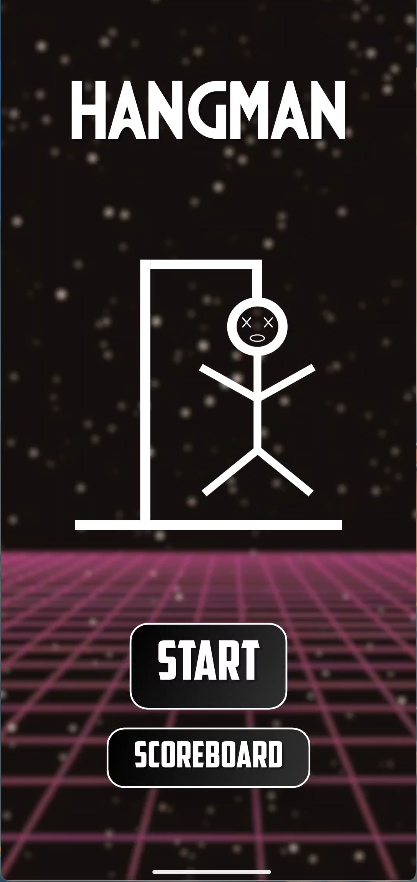
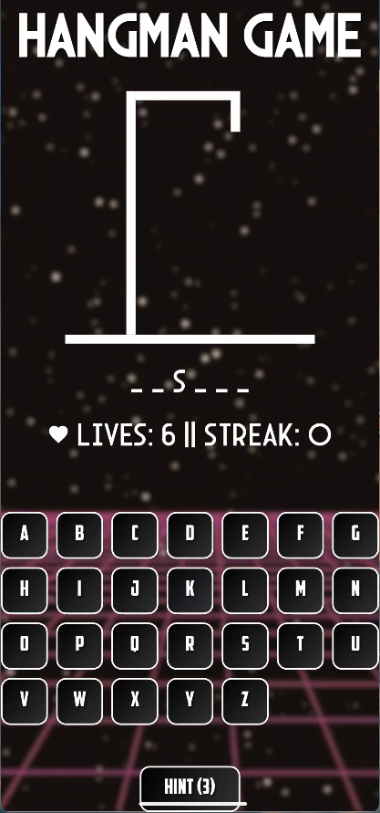

<h2>📸 Screenshots</h2>
<h3>Home Screen</h3>

<h3>Gameplay</h3>

<h2>🚀 About the Project</h2>

Hangman is a timeless word-guessing game, now reimagined with the power of Flutter! Guess letters, avoid the gallows, and have fun while sharpening your vocabulary skills! Built for smooth animations, a responsive UI, and an engaging experience.

<h2>✨ Features</h2>
<ul>
    <li>🏆 Multiple difficulty levels</li>
    <li>🎨 Beautiful, responsive UI</li>
    <li>🔀 Random word selection for endless fun</li>
    <li>⚡ Smooth animations and user-friendly interactions</li>
    <li>📊 Score tracking to challenge yourself</li>
</ul>

<h2>📥 Installation</h2>

Ready to play? Follow these steps:

<ol>
    <li><strong>Clone the repository</strong></li>
    <pre><code>git clone https://github.com/Roshan-Francis/hangman.git</code></pre>
    
    <li><strong>Navigate to the project directory</strong></li>
    <pre><code>cd hangman</code></pre>
    
    <li><strong>Ensure you have Flutter installed</strong></li>
    
If you haven’t installed Flutter, follow the official guide: <a href="https://docs.flutter.dev/get-started/install" target="_blank">Flutter Installation</a>

    <pre><code>flutter doctor</code></pre>
    
    <li><strong>Install dependencies</strong></li>
    <pre><code>flutter pub get</code></pre>
    
    <li><strong>Run the app</strong></li>
    
For Android Emulator / Physical Device:

    <pre><code>flutter run</code></pre>
    
For Web (if supported):

    <pre><code>flutter run -d chrome</code></pre>
    
    <li><strong>(Optional) Build APK for Android</strong></li>
    <pre><code>flutter build apk</code></pre>
    
The APK will be available in the <code>build/app/outputs/flutter-apk/</code> folder.

</ol>

<h2>🎯 How to Play</h2>
<ol>
    <li>The game randomly picks a word.</li>
    <li>Guess one letter at a time.</li>
    <li>Every wrong guess brings you closer to losing.</li>
    <li>Solve the word before you run out of attempts!</li>
</ol>

<h2>🛠️ Technologies Used</h2>
<ul>
    <li>Flutter 🦋</li>
    <li>Dart 🎯</li>
</ul>